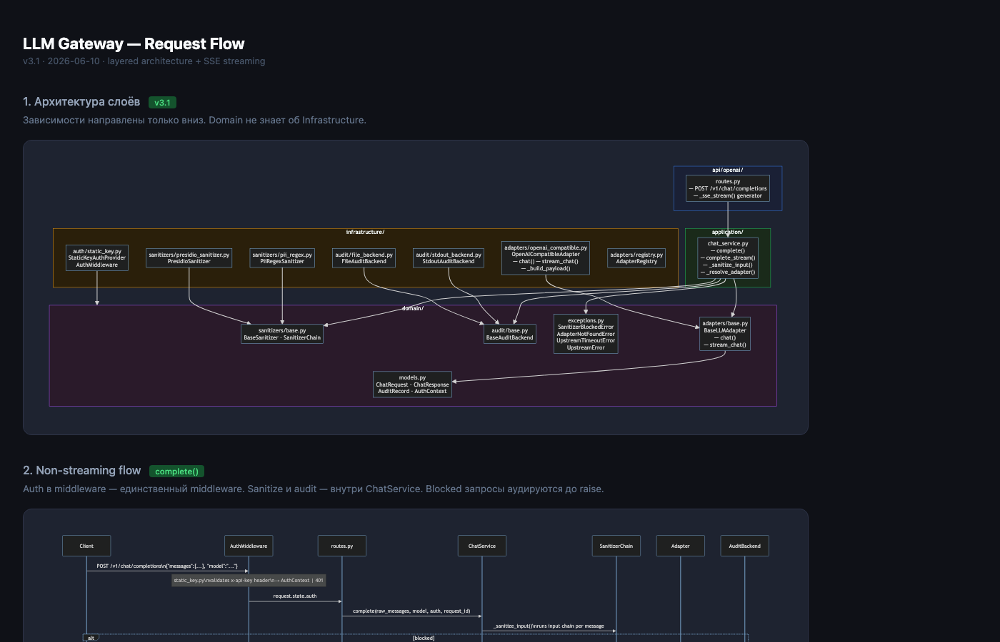

# LLM Gateway

[English](README.md)

Корпоративный LLM Gateway — OpenAI-совместимый прокси с журналом аудита, санитайзингом входных/выходных данных и подключаемыми адаптерами. Разворачивается внутри корпоративного контура, подключает любую LLM.

## Быстрый старт

### Docker (рекомендуется)

```bash
# 1. Скопировать конфиг и файл переменных окружения
cp gateway.yaml.example gateway.yaml
cp .env.example .env

# 2. Прописать API-ключ LLM в .env
#    OPENAI_API_KEY=sk-...

# 3. Запустить
docker-compose up

# 4. Проверить
curl http://localhost:8080/v1/chat/completions \
  -H "x-api-key: sk-change-me" \
  -H "Content-Type: application/json" \
  -d '{"model": "gpt-4o", "messages": [{"role": "user", "content": "Привет"}]}'
```

API-ключ `sk-change-me` задан в `gateway.yaml` в секции `auth.config.keys`.

### Локально (без Docker)

```bash
# 1. Установить (Python 3.11+)
pip install -e .

# 2. Скопировать конфиг и задать API-ключ
cp gateway.yaml.example gateway.yaml
export OPENAI_API_KEY=sk-...

# 3. Запустить
uvicorn gateway.app:create_app --factory --port 8080
```

Конфиг по умолчанию использует `PresidioSanitizer` (NLP-детекция PII). Перед первым запуском установите зависимости:

```bash
pip install -e ".[presidio]"
python -m spacy download en_core_web_lg   # ~750 МБ, один раз
```

Чтобы обойтись без этого и использовать regex-детекцию, замените санитайзер в `gateway.yaml` — закомментированный вариант есть в `gateway.yaml.example`.

## Архитектура

[](docs/ru/architecture.html)

> Откройте [`docs/ru/architecture.html`](docs/ru/architecture.html) для полной интерактивной версии со всеми потоками запросов.

Четыре слоя — зависимости направлены только вниз:

```
api/openai/        →  routes.py: StreamingResponse или JSONResponse
application/       →  ChatService: sanitize → adapter → audit (в finally)
domain/            →  BaseLLMAdapter, BaseSanitizer, BaseAuditBackend, models
infrastructure/    →  OpenAICompatibleAdapter, PresidioSanitizer, StdoutAuditBackend, …
```

`AuthMiddleware` — единственный middleware, всё остальное живёт в `ChatService`. Аудит пишется безусловно через `finally`, покрывая успех, ошибку и дисконнект клиента (`status="cancelled"`).

## Точки расширения

Три абстрактных контракта для реализации. Рабочие примеры в `examples/`:

### Кастомный LLM-адаптер — [`examples/custom_adapter.py`](examples/custom_adapter.py)

Вариант 1 — OpenAI-совместимый эндпоинт (без кода):
```yaml
adapters:
  - name: my-llm
    type: openai_compatible
    base_url: "https://your-llm.internal/v1"
    auth:
      token_env: MY_LLM_API_KEY
    default: true
```

Вариант 2 — кастомный адаптер (Python):
```bash
cp examples/custom_adapter.py my_adapters/my_llm.py
# реализовать метод chat()
```

```yaml
adapters:
  - name: my-llm
    type: plugin
    module: "my_adapters.my_llm.MyLLMAdapter"
    default: true
```

### Кастомный провайдер аутентификации — [`examples/custom_auth_provider.py`](examples/custom_auth_provider.py)

```python
from gateway.infrastructure.auth.base import BaseAuthProvider
from gateway.domain.models import AuthContext

class JWTAuthProvider(BaseAuthProvider):
    async def authenticate(self, request) -> AuthContext | None:
        token = request.headers.get("authorization", "").removeprefix("Bearer ")
        claims = verify_jwt(token)  # ваша JWT-библиотека
        if not claims:
            return None
        return AuthContext(
            key_id=hashlib.sha256(token.encode()).hexdigest()[:16],
            user_id=claims["sub"],
            team_id=claims.get("team"),
        )
```

```yaml
auth:
  module: "my_auth.jwt_provider.JWTAuthProvider"
  config:
    jwks_url: "https://your-idp.internal/.well-known/jwks.json"
```

### Кастомный санитайзер

```python
from gateway.domain.sanitizers.base import BaseSanitizer, SanitizeResult

class PiiSanitizer(BaseSanitizer):
    async def sanitize(self, text: str) -> SanitizeResult:
        cleaned, found = redact_pii(text)  # ваша PII-библиотека
        return SanitizeResult(
            text=cleaned,
            actions=[f"redacted:{t}" for t in found],
        )
```

```yaml
sanitizers:
  input:
    - module: "my_sanitizers.pii.PiiSanitizer"
  output: []
```

### Кастомный audit backend — [`examples/custom_audit_backend.py`](examples/custom_audit_backend.py)

```yaml
audit:
  type: plugin
  module: "my_backends.http_audit.HttpAuditBackend"
  config:
    endpoint: "https://audit.corp.internal/v1/events"
    token_env: AUDIT_TOKEN
```

## Разработка

```bash
# Установка с dev-зависимостями
pip install -e ".[dev]"

# Запуск тестов
pytest -v

# Запуск локально с автоперезагрузкой
uvicorn gateway.app:create_app --factory --port 8080 --reload
```

## Журнал аудита

Каждый аутентифицированный запрос генерирует запись аудита (JSON в stdout → направьте в ваш агрегатор логов):

```json
{
  "request_id": "uuid",
  "timestamp": "2026-06-05T10:00:00+00:00",
  "api_key_id": "sha256-first-16-chars",
  "user_id": "alice",
  "team_id": "engineering",
  "adapter": "openai",
  "model": "gpt-4o",
  "prompt_tokens": 150,
  "completion_tokens": 80,
  "latency_ms": 1234,
  "input_actions": [],
  "output_actions": [],
  "status": "success",
  "error": null
}
```

Содержимое запроса и ответа **никогда** не сохраняется в записи аудита, если не задано `audit.body_logging.enabled: true`.

## Документация

| Документ | Описание |
|---|---|
| [DEVLOG](docs/ru/DEVLOG.md) | Журнал разработки — решения, баги, инсайты по версиям |
| [Архитектура](docs/ru/architecture.html) | Интерактивные диаграммы: карта слоёв, потоки запросов, SSE wire format |
| [ADR-001: Python](docs/ru/adr/001-python-stack.md) | Почему Python, а не Go/Rust |
| [ADR-002: ASGI middleware](docs/ru/adr/002-asgi-middleware.md) | Почему ASGI middleware, а не event bus для аудита |
| [ADR-003: OpenAI-first](docs/ru/adr/003-openai-contract-first.md) | Почему OpenAI API как основной интерфейс |
| [ADR-004: Sync audit](docs/ru/adr/004-sync-audit.md) | Почему аудит синхронный и в теле запроса |
| [ADR-005: Порядок middleware](docs/ru/adr/005-middleware-order.md) | Auth → Sanitize → Audit и почему порядок важен |

## Лицензия

MIT
